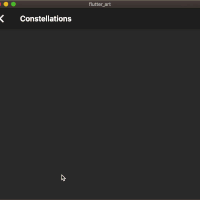
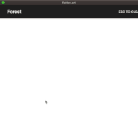

# Flutter art

Flutter art is a collection of apps where I try to build generative art projects . Since flutter uses Skia engine to render ( the same one google chrome uses to render it's 2D graphics ) , it's powerful enough to render generative arts by itself ( as long as it's 3D )

## Adding your own projects

If you want to showcase your projects please go to `lib` and create a folder and according to your art name and also go to the `lib/main.dart` folder and add your project like this .

```dart
_project(
  title: "My Project",
  subtitle: "My Project description",
  page: MyProject(),
  context: context,
),
```

## Preview

| Preview                                  | Path                                     |
| ---------------------------------------- | ---------------------------------------- |
|  | `lib/constellations/constellations.dart` |
|          | `lib/forest/forest.dart`                 |
